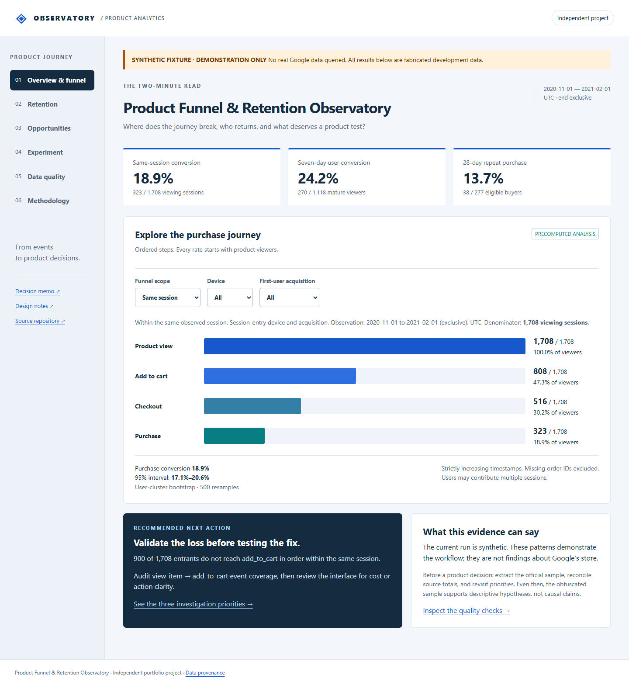
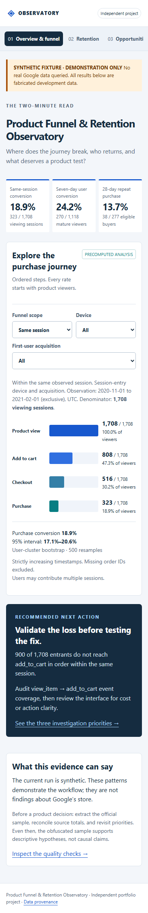
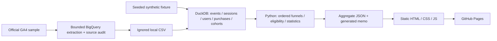

# Product Funnel & Retention Observatory

An **independent portfolio project** demonstrating event modeling, SQL, product funnels, retention, uncertainty, measurement design and product judgment.

**Data status: synthetic development fixture. No real Google data has been queried.** Official sample documentation was verified, and executable bounded extraction SQL is included. No shipped experiment, realized revenue impact, or real customer finding is claimed.

## Quick tour

1. Explore the session funnel, then switch to mature seven-day users.
2. Inspect first-observed retention and excluded immature cells.
3. Compare device/channel rates with denominators and uncertainty.
4. Review three falsifiable hypotheses and change assumptions in the power calculator.
5. Inspect the quality ledger, provenance, SQL and edge-case tests.



<details><summary>Mobile presentation</summary>



</details>

## Findings and recommended next action

<!-- GENERATED FINDINGS START -->
All figures below are **synthetic fixture results**, not Google-store findings. Observation window: 2020-11-01 inclusive to 2021-02-01 exclusive, UTC.

| Measure | Validated fixture result |
|---|---|
| Input → modeled events | 7,165 → 7,165; event-name totals reconcile |
| Ordered session funnel | 1,708 → 808 → 516 → 323 |
| Session conversion | 323/1,708 = 18.9%; 95% cluster interval 17.1%–20.6% |
| Seven-day user conversion | 270/1,118 = 24.2%; 95% Wilson interval 21.7%–26.7% |
| 28-day repeat purchase | 38/277 = 13.7%; 95% Wilson interval 10.2%–18.3% |
| Purchase reconciliation | 483 raw = 440 canonical + 39 duplicate + 4 missing ID |
| Incomplete user follow-up | 82 first-view users excluded |

The largest fixture step loss is product view → cart. The recommended next action is to validate instrumentation and investigate friction, **not** to claim an opportunity's causal or revenue value. See the [one-page decision memo](docs/decision-memo.md).
<!-- GENERATED FINDINGS END -->

## Architecture



The current executed path starts at the fixture. The real-data path is supplied but unexecuted. Source transformations and statistical analysis are separate from presentation. There is no runtime warehouse connection, backend, API key, CDN dependency, or raw user data in the site. Plain static assets keep GitHub Pages deployment portable.

## Setup and fast smoke mode

Python **3.12** and Git are prerequisites. Runtime dependency is pinned DuckDB; statistics use Python's standard library. Dev/browser and optional extraction dependencies are pinned separately.

```sh
python -m venv .venv
# macOS/Linux: source .venv/bin/activate
# Windows PowerShell: .venv\Scripts\Activate.ps1
python -m pip install -r requirements.txt
python -m unittest discover -s tests -v
python -m observatory.pipeline --fixture
python scripts/write_summary.py
python scripts/build.py
python -m http.server 8000 --directory dist
```

Open `http://localhost:8000`. The fixture workflow needs no cloud account. Serve over HTTP; opening HTML directly with `file://` may block fetching JSON.

Optional browser verification:

```sh
python -m pip install -r requirements-dev.txt
python -m playwright install chromium
python scripts/browser_test.py
```

Browser tests start their own temporary HTTP server, exercise every route on desktop/mobile, filter intersections, empty populations, calculator validity and keyboard focus, and save screenshots in `outputs/screenshots/`.

## Real data acquisition

Read [provenance](docs/provenance.md) and the [safe extraction guide](docs/extraction.md). The official sample covers 2020-11-01–2021-01-31 and requires an authenticated Google Cloud project with BigQuery API access. Do not assume credentials, remaining free quota, or authorization to incur charges. Dry-run both bounded queries and use a maximum-bytes-billed cap before execution.

```sh
python scripts/reconcile_source.py data/raw/events.csv data/raw/source-audit.csv
python -m observatory.pipeline --input data/raw/events.csv --start 2020-11-01 --end-exclusive 2021-02-01
python scripts/write_summary.py
python scripts/build.py
```

Do not publish a real-data run until updating the fixture-specific narrative and CI snapshot policy after review. Raw data and credentials remain outside Git.

## Project map

| Location | Purpose |
|---|---|
| `sql/` | BigQuery extraction, independent source audit, five DuckDB models |
| `observatory/` | Fixture generator, pipeline and statistical functions |
| `tests/` | Handcrafted edge cases and reconciliation invariants |
| `scripts/` | Extraction, source reconciliation, narrative/site build and browser QA |
| `site/` | Static app and precomputed aggregate snapshot |
| `docs/` | Methodology, taxonomy, metric definitions, provenance and portfolio materials |
| `.github/workflows/` | CI and GitHub Pages deployment |

## Validation and limits

Tests cover composite sessions, cross-midnight sessions, missing identifiers, repeated parameters, strict ordering and ties, recovery from out-of-order events, cross-session continuation, seven-day boundaries, denominator eligibility, global purchase deduplication, complete-cohort maturity, return-session requirements, repeat purchase, filter partitions, intervals and power. Independent source reconciliation rejects truncated exports and mismatched users/revenue. Local fixture counts are reconciled; **BigQuery reconciliation has not run**.

This is not a causal analysis. The source's obfuscation, first-observed identities, missing IDs, cookie/device fragmentation, boundary sessions, short historical window and seasonality all constrain interpretation. Session CIs use 500 user-cluster bootstrap resamples; user metrics use Wilson intervals. Exploratory segment differences are unadjusted for multiplicity. Read [the analytical walkthrough](docs/analysis-walkthrough.md) for choices and objections.

The fixture is intentionally not a statistically realistic population. Its results demonstrate engineering behavior. The live source schema and authenticated extraction helper remain unverified against BigQuery.

## GitHub Pages

The `Deploy GitHub Pages` workflow builds and deploys on `main` and `project/product-funnel-retention-observatory`, or manual dispatch. In **Settings → Pages → Build and deployment → Source**, select **GitHub Actions**. If repository policy restricts environments, permit the project branch to deploy to `github-pages`. CI runs separately for all pushes and pull requests; the Pages build also gates on analytical tests and deterministic snapshot reproduction.

Never publish raw CSV exports. The current deployment workflow explicitly regenerates the fixture. No live URL is claimed until the deployment and HTTP response are verified.

## Portfolio materials

- [One-page product decision memo (PDF)](outputs/product-decision-memo.pdf) · [HTML](docs/decision-memo.html) · [Markdown](docs/decision-memo.md)
- [Analysis walkthrough](docs/analysis-walkthrough.md)
- [Data dictionary, taxonomy and metric definitions](docs/data-dictionary.md)
- [Measurement design notes](docs/design-notes.md)
- [Source provenance and limitations](docs/provenance.md)
